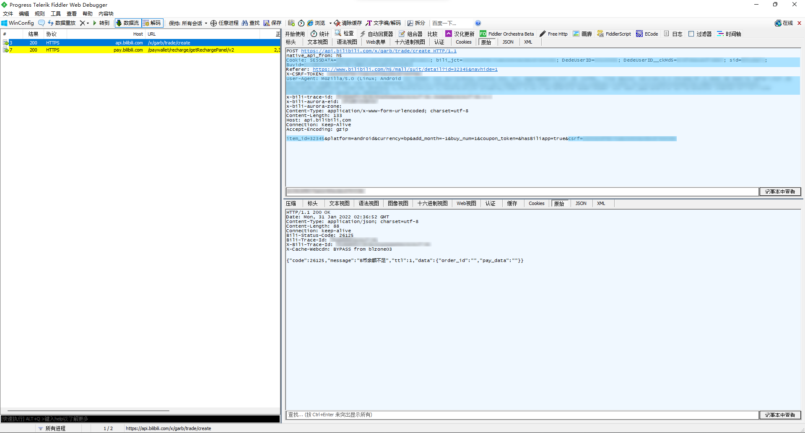
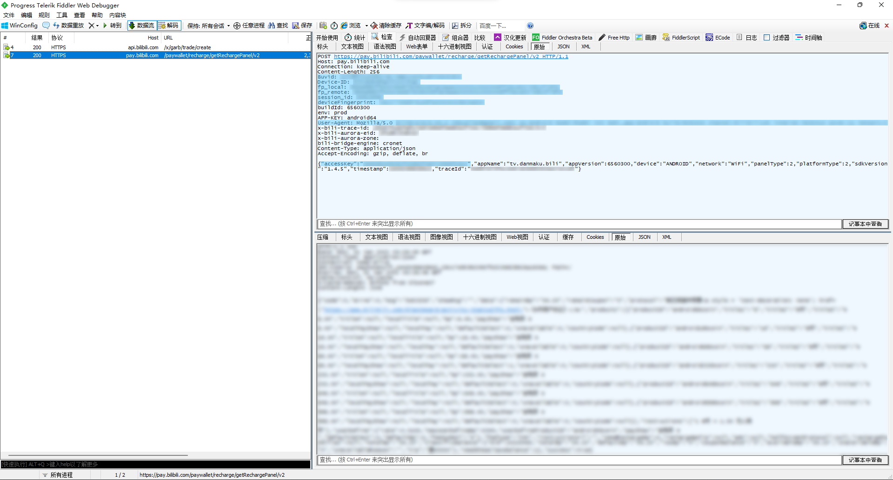
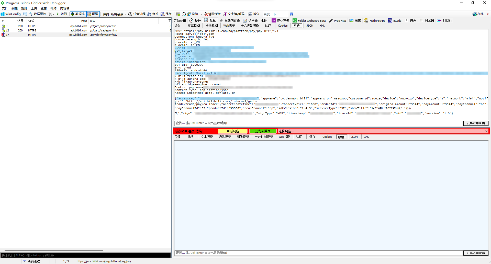

# BilibiliSuitRushBuy[哔哩哔哩装扮抢购脚本]

## 这个脚本为啥有两个分支？

- [`master`](https://github.com/WankkoRee/BilibiliSuitRushBuy/tree/master) 分支为蹲号抢Id模式
  ```shell
  git clone -b master https://github.com/WankkoRee/BilibiliSuitRushBuy.git
  ```
- [`withoutIDRequirement`](https://github.com/WankkoRee/BilibiliSuitRushBuy/tree/withoutIDRequirement) 分支为定时抢购模式
  ```shell
  git clone -b withoutIDRequirement https://github.com/WankkoRee/BilibiliSuitRushBuy.git
  ```

## 这个脚本和其他仓库有什么不同？

1. 本项目采用`Golang`编写，比其他采用`Python`编写的脚本更加快速
2. 本脚本功能齐全，可以提前开启并在合理配置参数时保证不 ban IP
3. 本脚本功能齐全，可以实现抢指定装扮Id
4. 本脚本功能齐全，可以实现单个订单购买多个同一装扮，使得抢指定装扮Id的成功率大大增加
5. 还有其他细节部分请自行阅读源码发现，不予列出...

## 关于数据包参数的获取？

- 如果B币余额不足，那么使用任意抓包工具皆可在环境配置正确的情况下获取到所有的所需参数
- 如果B币余额充足，请务必使用诸如`Fiddler`等带有 发送断点 功能的抓包工具进行抓取所需参数，若不开启发送断点那么真的会在抓包时直接购买成功
- 当然如果家里有矿不在意这些小钱的话，那么随便用啥抓都行，不就是一个装扮钱吗

## 能不能来点抓包的demo图？

> 以下图片**蓝色涂描部分**包含脚本中的`itemId`、`apiCsrf`、`apiCookie`、`apiUserAgent`
> 

> 以下图片分别为余额不足时和余额充足时的数据包，**蓝色涂描部分**皆包含脚本中的`apiAccessKey`、`payUserAgent`、`payBuvid`、`payDeviceID`、`payFpLocal`、`payFpRemote`、`paySessionId`、`payDeviceFingerprint`
> 
> 

## 这个仓库的代码为什么那么烂？

这是我刚开始学习`Golang`并且第一次用于实践用途，所以代码质量难以保证，如果觉得有任何可以改进的部分欢迎提交pr。

## 脚本用途声明

### 仅限用于个人自身对B站装扮的需求，不可对本脚本及本脚本的产出进行贩卖
### 严禁装扮贩子使用本脚本，否则任何法律问题请自行解决，与本人及本脚本无关
